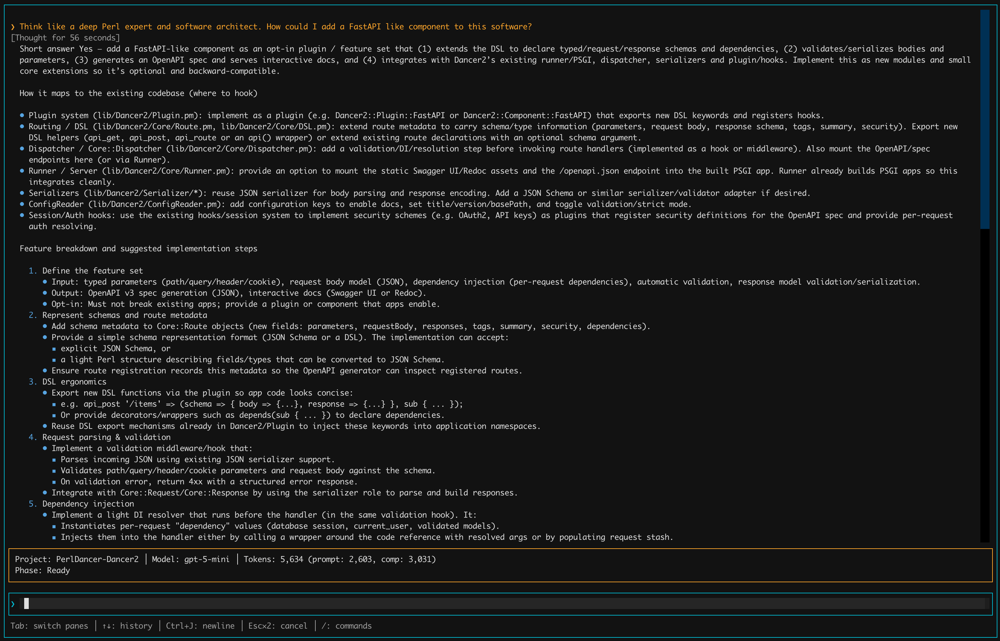
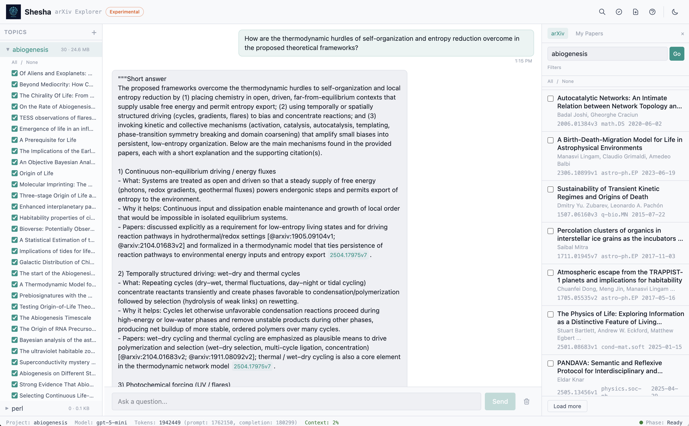

# Shesha

<p align="center">
  
</p>

**Ask complex questions across large document collections—and get answers with citations**

Shesha lets AI explore your documents, [even large codebases](examples/repo.py), the way a researcher would: reading, searching, cross-referencing, and iterating until it finds the answer. Most AI search tools grab a few relevant paragraphs and hope for the best. Shesha reads everything, designs its own research strategy for your specific question, and keeps digging until it's confident.

<p align="center">
  
</p>

_**Note** for fans of [Perl's Dancer2 framework](https://github.com/PerlDancer/Dancer2): I'm not seriously proposing the above._

**How it's different:** The AI writes Python code to actively explore your documents in a secure sandbox, iterating until confident in the answer—no context window limits, no lost information. This approach is based on [Recursive Language Models](https://arxiv.org/abs/2512.24601), a new technique that gives AI effectively unlimited reading capacity.

## See It in Action

Here's a real session querying 7 novels (~2.8M characters), demonstrating three key capabilities:

1. **Guardrails** — Politely refuses out-of-scope questions while explaining why
2. **Simple lookup** — Quick fact retrieval from the document collection
3. **Complex multi-document reasoning** — Tracks events across 7 books, orders them chronologically, cites supporting quotes, and identifies continuity conflicts

```
$ python examples/barsoom.py

Ask questions about the Barsoom series. Type "quit" or "exit" to leave.

> What is the capital of Malawi?
[Thought for 7 seconds]
The documents provided are Barsoom (Mars) texts and do not contain information
about Malawi. I can't find the capital of Malawi in the provided documents.

> Who is the son of Dejah Thoris and John Carter?
[Thought for 29 seconds]
The son of Dejah Thoris and John Carter is **Carthoris of Helium**.

> What are the major events in his life, in the order they happened?
[Thought for 227 seconds]
1) **Named "Carthoris" in childhood (a deliberate blend of his parents' names)**
- Key people/places: Carthoris; Dejah Thoris; John Carter; Helium
- Quote: "so the name that she called me is the one that you desired, a
  combination of hers and yours—Carthoris."

2) **Has a younger sister, Tara (family context established)**
- Key people/places: Carthoris; Tara of Helium; John Carter
- Quote: "'A daughter,' he replied, 'only a little younger than Carthoris,
  … Tara of Helium.'"

3) **Disappears (triggering prolonged grief and major search expeditions)**
- Key people/places: Carthoris; Dejah Thoris; Tardos Mors; Helium
- Quote: "Ever since Carthoris disappeared, Dejah Thoris has grieved and
  mourned for her lost boy."

...

21) **Develops the destination control compass, sparking a new era of invention**
- Key people/places: Carthoris; Barsoom's scientists/engineers; Helium
- Quote: "The perfection of the destination control compass by Carthoris
  of Helium… marked the beginning of a new era of invention."

...

30) **Later-life stability: Thuvia is his mate; he hunts in Okar with Talu**
- Key people/places: Carthoris; Thuvia of Ptarth; Talu (Jeddak of Okar)
- Quote: "Thuvia of Ptarth… while Carthoris, her mate, hunted in Okar."

### Noted conflict across sources
- **Thuvia's status** conflicts (promised to another vs. called his mate).
  Resolution: treated as narrative progression—first promised elsewhere,
  later described as his mate (implying circumstances changed).
```

The third question searched across all 7 novels, extracted 30 chronological events with supporting quotes, and identified a continuity conflict between books—the kind of deep, cross-document analysis that typically trips up standard AI approaches.

## Alpha Code

So far it seems to work, but it's only been tested with .txt documents and the OpenAI API. It _should_ support PDFs, Word Documents, and other files — feedback welcome.

## Prerequisites

- Python 3.12+
- Docker (for sandbox execution)
- An LLM API key (or local Ollama installation)

## Supported LLM Providers

Works with 100+ LLM providers via [LiteLLM](https://github.com/BerriAI/litellm) — Anthropic, OpenAI, Google, Azure, AWS Bedrock, and local models through [Ollama](https://ollama.com/) (no API key needed). See [docs/ENVIRONMENT.md](docs/ENVIRONMENT.md) for provider setup details.

## Installation

### From PyPI (when published)

```bash
pip install shesha
```

### From Source


```bash
git clone https://github.com/Ovid/shesha.git
cd shesha

# Create and activate a virtual environment
python3 -m venv .venv
source .venv/bin/activate  # On Windows: .venv\Scripts\activate

# Install with dev dependencies
pip install -e ".[dev]"
```

### Build the Sandbox Container

The sandbox container is required for code execution:

```bash
docker build -t shesha-sandbox -f src/shesha/sandbox/Dockerfile src/shesha/sandbox/
```

Verify the build:

```bash
echo '{"action": "ping"}' | docker run -i --rm shesha-sandbox
# Should output: {"status": "ok", "message": "pong"}
```

## Configuration

Set your API key and optionally specify a model:

```bash
export SHESHA_API_KEY="your-api-key-here"
export SHESHA_MODEL="claude-sonnet-4-20250514"  # Default model
```

Shesha also supports programmatic configuration, YAML config files, and per-provider API keys. See [docs/ENVIRONMENT.md](docs/ENVIRONMENT.md) for all options.

## Quick Start

```python
from shesha import Shesha

# Initialize (uses SHESHA_API_KEY from environment)
shesha = Shesha(model="claude-sonnet-4-20250514")

# Create a project and upload documents
project = shesha.create_project("research")
project.upload("papers/", recursive=True)
project.upload("notes.md")

# Query the documents
result = project.query("What are the main findings?")
print(result.answer)

# Inspect execution details
print(f"Completed in {result.execution_time:.2f}s")
print(f"Tokens used: {result.token_usage.total_tokens}")

# View the execution trace
for step in result.trace.steps:
    print(f"[{step.type.value}] {step.content[:100]}...")
```

## Try the Example

The repo includes an interactive example that lets you query the Barsoom novels (Edgar Rice Burroughs' Mars series, public domain):

```bash
# Make sure you're in the project directory with venv activated
cd shesha
source .venv/bin/activate

# Set your API key
export SHESHA_API_KEY="your-api-key-here"

# Optional: specify a model (defaults to claude-sonnet-4-20250514)
export SHESHA_MODEL="gpt-4o"  # or claude-sonnet-4-20250514, gemini/gemini-1.5-pro, etc.

# Run the interactive explorer
python examples/barsoom.py
```

On first run, it uploads the 7 Barsoom novels to a local project. Then you can ask questions:

```
> Who is Dejah Thoris?
[Thought for 12 seconds]
Dejah Thoris is the Princess of Helium and the primary love interest of John Carter...

> What weapons are commonly used on Barsoom?
[Thought for 8 seconds]
The Martians use a variety of weapons including...
```

Use `--verbose` for execution stats, or `--prompt "question"` for non-interactive mode:

```bash
python examples/barsoom.py --verbose
python examples/barsoom.py --prompt "How does John Carter travel to Mars?"
```

## Analyzing Codebases

Shesha can ingest entire git repositories for deep code analysis with accurate file:line citations:

```python
from shesha import Shesha

with Shesha() as s:
    # Ingest a GitHub repository
    result = s.create_project_from_repo(
        url="https://github.com/org/repo",
        token="ghp_xxxxx",  # Optional, for private repos
    )

    print(f"Status: {result.status}")
    print(f"Files ingested: {result.files_ingested}")

    # Query the codebase
    answer = result.project.query("How does authentication work?")
    print(answer.answer)  # Includes file:line citations

    # Update when changes are available
    if result.status == "updates_available":
        result = result.apply_updates()
```

The codebase analyzer:
- Supports GitHub, GitLab, Bitbucket, and local git repos
- Uses shallow clones for efficiency
- Tracks SHA for change detection
- Formats code with line numbers for accurate citations
- Handles various encodings via `chardet`
- Detects language from file extensions and shebangs

### Repository Explorer CLI

For interactive codebase exploration, use the `repo.py` example script:

```bash
# Set your API key
export SHESHA_API_KEY="your-api-key-here"

# Optional: specify a model (defaults to claude-sonnet-4-20250514)
export SHESHA_MODEL="gpt-4o"  # or gemini/gemini-1.5-pro, ollama/llama3, etc.

# Explore a GitHub repository
python examples/repo.py https://github.com/org/repo

# Explore a local git repository
python examples/repo.py /path/to/local/repo

# Run without arguments to see a picker of previously indexed repos
python examples/repo.py
```

The picker mode lets you select from previously indexed repositories or enter a new URL:

```
Available repositories:
  1. org-repo
  2. another-project

Enter number or new repo URL: 1
Loading project: org-repo

Ask questions about the codebase. Type "quit" or "exit" to leave.

> How does authentication work?
[Thought for 15 seconds]
Authentication is handled in src/auth/handler.py:42...
```

Command line options:

| Flag | Description |
|------|-------------|
| `--update` | Auto-apply updates without prompting when changes are detected |
| `--verbose` | Show execution stats (time, tokens, trace) after each answer |

```bash
# Auto-update and show stats
python examples/repo.py https://github.com/org/repo --update --verbose
```

## arXiv Explorer

The [arXiv Explorer](arxiv-explorer/) is a web-based research tool that lets you search arXiv, add papers to topics, and ask plain-English questions across dozens of papers at once. Shesha writes and runs code to dig through your documents, iterating until it finds a real answer with citations you can verify against the source.

<p align="center">
  
</p>

_The screenshot above shows Shesha searching through nearly 25 MB of research papers to answer a complex question._

## DeepWiki

We love DeepWiki — it's an amazing tool that covers much of the same ground. But there are reasons you might prefer Shesha:

1. **Your code, your schedule** — update whenever you want, not once a week
2. **Your model, your choice** — pick any provider, or run locally with Ollama so nothing leaves your machine
3. **Free and open source** — MIT license, no usage limits, no lock-in
4. **See how it thinks** — every query logs its full reasoning trace, so you can see *how* the answer was found
5. **Run it your way** — embed it as a library, use the CLI, or wrap a web interface around it

## How It Works

1. **Upload**: Documents are parsed and stored in a project
2. **Query**: Your question is sent to the LLM with a sandboxed Python REPL
3. **Explore**: The LLM writes Python code to analyze documents (available as `context`)
4. **Execute**: Code runs in an isolated Docker container
5. **Iterate**: LLM sees output, writes more code, repeats until confident
6. **Answer**: LLM calls `FINAL("answer")` to return the result

For large documents, the LLM can use `llm_query(instruction, content)` to delegate analysis to a sub-LLM call.

## Supported Document Formats

| Category | Extensions |
|----------|------------|
| Text | `.txt`, `.md`, `.csv` |
| Code | `.py`, `.js`, `.ts`, `.go`, `.rs`, `.java`, `.c`, `.cpp`, `.h`, `.hpp` |
| Documents | `.pdf`, `.docx`, `.html` |

## Running Tests

```bash
# Install dev dependencies
pip install -e ".[dev]"

# Run all tests
pytest

# Run with coverage
pytest --cov=shesha

# Type checking
mypy src/shesha

# Linting
ruff check src tests

# Format code
ruff format src tests

# Run everything
make all
```

## Development Setup

See [docs/DEVELOPMENT.md](docs/DEVELOPMENT.md) for local tooling and GitHub Copilot setup.

## Project Structure

```
src/shesha/
├── __init__.py          # Public API exports
├── shesha.py            # Main Shesha class
├── project.py           # Project class
├── config.py            # SheshaConfig
├── models.py            # ParsedDocument
├── exceptions.py        # Exception hierarchy
├── storage/             # Document storage backends
├── parser/              # Document parsers
├── llm/                 # LiteLLM wrapper
├── sandbox/             # Docker executor
│   ├── Dockerfile
│   ├── runner.py        # Runs inside container
│   ├── executor.py      # Host-side container management
│   └── pool.py          # Container pool
└── rlm/                 # RLM engine
    ├── engine.py        # Core loop
    ├── prompts.py       # Hardened system prompts
    └── trace.py         # Execution tracing
```

## Security

See [SECURITY.md](SECURITY.md) for details on:
- Threat model
- Prompt injection defenses
- Docker sandbox isolation
- Network policies

## Who is Shesha?

[Shesha](https://en.wikipedia.org/wiki/Shesha), also known as Ananta, is a Hindu deity who embodies the concept of infinity and the eternal cycle of existence. He is famously depicted with a thousand heads that support the planets of the universe, representing a foundational stability that allows for the maintenance of vast, complex structures. As the celestial couch of the preserver deity Vishnu, he remains constant even as the world undergoes cycles of creation and dissolution, mirroring the ability of recursive models to manage essentially unbounded-length reasoning chains.

# RLM Reference

Internal engine borrows heavily from [this reference implementation](https://github.com/alexzhang13/rlm) by the authors of the original paper.

## Using the Reference RLM or Shesha?

Choose Reference RLM if you:

- Want a lightweight library to integrate into your own application (Shesha is a bit heavier-weight, but can also be embedded)
- Need cloud sandbox support (Modal, Prime Intellect, Daytona)
- Want to use different models for root vs. sub-LM calls
- Prefer minimal dependencies
- Are doing research and want the exact paper implementation
- Want the React trajectory visualizer

Choose Shesha if you:

- Need conversation history and follow-up questions
- Want answer verification (citation + semantic)
- Need an RLM designed for code as well as for raw documents
- Need security — running on untrusted documents or in shared environments
- Want document parsing (PDF, DOCX, HTML, code) out of the box
- Want an interactive TUI or CLI experience
- Need production resilience (retry, container pooling, incremental traces)
- Want a git repository analysis tool

## What About RAG?

Most AI document tools use Retrieval-Augmented Generation (RAG): they find a few relevant paragraphs, feed them to the AI, and hope the answer is in there. That works great when the answer lives in one or two passages and you need fast, predictable responses.

Shesha takes a different approach. Instead of retrieving snippets, the AI reads your documents directly, writes code to search and cross-reference them, and keeps iterating until it's confident. This matters when:

- The answer spans many documents or requires connecting information across them
- Your documents are too large for an AI to read in one pass
- The question requires reasoning, not just lookup — like tracking a character across 7 novels or understanding how an authentication system works across dozens of source files

The tradeoff: Shesha is slower and uses more tokens than RAG. But for questions that RAG gets wrong — because the answer isn't in any single chunk — Shesha gets them right.

## License

MIT - see [LICENSE](LICENSE)

## Author

Curtis "Ovid" Poe
